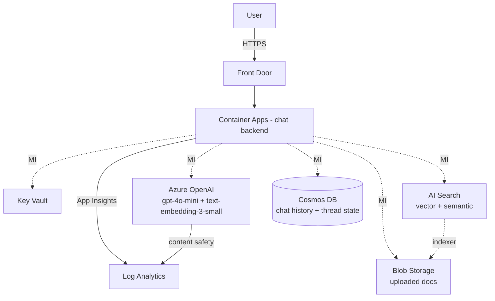

# Pattern: AI app (LLM / RAG / agent)

For chatbots, RAG over enterprise data, AI agents, document Q&A. Single pattern that stretches up to enterprise.

## Architecture



## Components

| Component | Choice | Why |
|---|---|---|
| Backend | Container Apps + Python/Node FastAPI/Express | streaming SSE for completions |
| LLM | Azure OpenAI: gpt-4o-mini (default) + gpt-4o (high-stakes) | balance cost/quality |
| Embeddings | text-embedding-3-small | cheap, 1536d, fast |
| Vector store | Azure AI Search (vector + hybrid + semantic) | best Azure-native; alt: Cosmos for vector |
| Conversation memory | Cosmos DB NoSQL (thread + message containers) | low latency, easy partition by user/tenant |
| Doc storage | Blob Storage (ADLS for analytics later) | source for indexer |
| Observability | App Insights with custom dimensions: `model`, `tenant`, `tokens_in`, `tokens_out`, `latency_ms` | per-request token tracking |
| Auth | Entra External ID for customers / Entra ID for workforce | |
| Optional: agents | Azure AI Foundry workspace | for tool-using agents |

## Bicep additions over webapp-saas

Add these modules on top of the webapp pattern:

```bicep
module openai 'modules/openai.bicep' = {
  name: 'openai'
  params: {
    name: 'oai-${namePrefix}-${environment}'
    location: openAiRegion  // e.g. swedencentral, eastus
    tags: tags
    privateEndpointSubnetId: vnet.outputs.dataSubnetId
    workspaceId: la.outputs.workspaceId
    deployments: [
      {
        name: 'gpt-4o-mini'
        model: { name: 'gpt-4o-mini', version: '2024-07-18' }
        sku: { name: 'GlobalStandard', capacity: 250 }    // 250K TPM (tokens per minute)
      }
      {
        name: 'gpt-4o'
        model: { name: 'gpt-4o', version: '2024-08-06' }
        sku: { name: 'Standard', capacity: 30 }
      }
      {
        name: 'text-embedding-3-small'
        model: { name: 'text-embedding-3-small', version: '1' }
        sku: { name: 'Standard', capacity: 350 }
      }
    ]
  }
}

module aisearch 'modules/ai-search.bicep' = {
  name: 'aisearch'
  params: {
    name: 'srch-${namePrefix}-${environment}'
    location: location
    tags: tags
    sku: environment == 'prod' ? 'standard' : 'basic'
    semanticSearch: 'standard'
    privateEndpointSubnetId: vnet.outputs.dataSubnetId
    workspaceId: la.outputs.workspaceId
  }
}

module cosmos 'modules/cosmos.bicep' = {
  name: 'cosmos'
  params: {
    name: 'cosmos-${namePrefix}-${environment}'
    location: location
    tags: tags
    privateEndpointSubnetId: vnet.outputs.dataSubnetId
    workspaceId: la.outputs.workspaceId
    databases: [
      {
        name: 'chat'
        containers: [
          { name: 'threads', partitionKey: '/tenantId' }
          { name: 'messages', partitionKey: '/threadId' }
        ]
      }
    ]
    autoscale: true
    maxThroughput: environment == 'prod' ? 4000 : 1000
  }
}

// RBAC for app's MI
module rbacOpenAI 'modules/role-assignment.bicep' = {
  name: 'rbac-openai'
  params: {
    principalId: umi.outputs.principalId
    // Cognitive Services OpenAI User
    roleDefinitionId: '5e0bd9bd-7b93-4f28-af87-19fc36ad61bd'
    scope: openai.outputs.id
  }
}
module rbacSearch 'modules/role-assignment.bicep' = {
  name: 'rbac-search'
  params: {
    principalId: umi.outputs.principalId
    // Search Index Data Contributor
    roleDefinitionId: '8ebe5a00-799e-43f5-93ac-243d3dce84a7'
    scope: aisearch.outputs.id
  }
}
module rbacCosmos 'modules/role-assignment.bicep' = {
  name: 'rbac-cosmos'
  params: {
    principalId: umi.outputs.principalId
    // Cosmos DB Built-in Data Contributor (data plane, not control)
    roleDefinitionId: '00000000-0000-0000-0000-000000000002'
    scope: cosmos.outputs.id
    isCosmosBuiltIn: true   // module branches to Microsoft.DocumentDB/sqlRoleAssignments
  }
}
```

## App env vars (added to CA)

```
AZURE_OPENAI_ENDPOINT=https://oai-acme-prod.openai.azure.com
AZURE_OPENAI_DEPLOYMENT_CHAT=gpt-4o-mini
AZURE_OPENAI_DEPLOYMENT_EMBED=text-embedding-3-small
AZURE_AI_SEARCH_ENDPOINT=https://srch-acme-prod.search.windows.net
AZURE_AI_SEARCH_INDEX=docs
COSMOS_ENDPOINT=https://cosmos-acme-prod.documents.azure.com
COSMOS_DATABASE=chat
APPLICATIONINSIGHTS_CONNECTION_STRING=<from AI>
```

App authenticates via `DefaultAzureCredential` (MI in cloud, `az login` in dev).

## Reference app (Python sketch)

```python
from azure.identity.aio import DefaultAzureCredential
from openai import AsyncAzureOpenAI
from azure.search.documents.aio import SearchClient
from azure.cosmos.aio import CosmosClient
from opentelemetry.instrumentation.openai import OpenAIInstrumentor

# Auth
cred = DefaultAzureCredential()

# OpenAI
async def get_token():
    return (await cred.get_token("https://cognitiveservices.azure.com/.default")).token

oai = AsyncAzureOpenAI(
    azure_endpoint=os.environ["AZURE_OPENAI_ENDPOINT"],
    api_version="2024-10-21",
    azure_ad_token_provider=get_token,
)
OpenAIInstrumentor().instrument()  # OTel auto-traces calls

# Search
search = SearchClient(endpoint=..., index_name="docs", credential=cred)

# Cosmos (uses RBAC role above)
cosmos = CosmosClient(url=os.environ["COSMOS_ENDPOINT"], credential=cred)

# RAG flow
async def chat(query: str, thread_id: str, tenant_id: str):
    # 1. embed
    emb = (await oai.embeddings.create(
        model="text-embedding-3-small", input=query
    )).data[0].embedding

    # 2. search
    results = await search.search(
        search_text=query,
        vector_queries=[{"vector": emb, "k_nearest_neighbors": 5, "fields": "vector"}],
        query_type="semantic",
        semantic_configuration_name="default",
        top=5
    )
    context = "\n\n".join([r["content"] async for r in results])

    # 3. completion (streaming)
    stream = await oai.chat.completions.create(
        model="gpt-4o-mini",
        messages=[
            {"role": "system", "content": f"Answer from CONTEXT. Cite sources.\n\nCONTEXT:\n{context}"},
            {"role": "user", "content": query}
        ],
        stream=True,
        # PROMPT CACHING for the system message
        extra_headers={"prompt_cache_key": f"sys-rag-v1-{tenant_id}"},
    )

    full = ""
    async for chunk in stream:
        if delta := chunk.choices[0].delta.content:
            full += delta
            yield delta

    # 4. persist to Cosmos
    await cosmos.get_database_client("chat").get_container_client("messages").create_item({
        "id": str(uuid.uuid4()), "threadId": thread_id, "tenantId": tenant_id,
        "role": "user", "content": query, "ts": datetime.utcnow().isoformat()
    })
    # ... persist assistant reply
```

## Index design (AI Search)

```python
SearchIndex(
    name="docs",
    fields=[
        SimpleField(name="id", type="Edm.String", key=True),
        SearchableField(name="content", type="Edm.String", analyzer="en.microsoft"),
        SimpleField(name="tenantId", type="Edm.String", filterable=True),  # multi-tenant filter
        SimpleField(name="source", type="Edm.String", filterable=True, facetable=True),
        SimpleField(name="updated", type="Edm.DateTimeOffset", sortable=True),
        SearchField(name="vector", type="Collection(Edm.Single)",
                    vector_search_dimensions=1536,
                    vector_search_profile_name="default"),
    ],
    semantic_search=SemanticSearch(configurations=[
        SemanticConfiguration(name="default", prioritized_fields=...)
    ]),
    vector_search=VectorSearch(
        algorithms=[HnswAlgorithmConfiguration(name="hnsw")],
        profiles=[VectorSearchProfile(name="default", algorithm_configuration_name="hnsw")],
    ),
)
```

Multi-tenant: filter on `tenantId` in every query. Use **AAD-authenticated indexer** to keep doc ingestion automated from Blob.

## Cost guards (most ignored)

- **Track tokens per user/feature**: emit App Insights custom metric `tokens_used` with dim `model` + `tenant`.
- **Set TPM quota alerts** at 70% / 90% on each deployment.
- **Switch to PTU** when sustained >70% of standard quota - predictable + cheaper at high volume.
- **Use prompt caching**: cache system + few-shot examples (≥1024 tokens). 50% input discount.
- **Use Batch API** for offline jobs: ~50% discount.
- **Embedding dim**: 1536 (small) is usually enough; only use 3072 (large) if eval shows real lift.
- **Hybrid search rerank**: cheaper than calling LLM for re-ranking.

## Adjacent integrations

- **Content Safety**: Azure AI Content Safety to filter inputs (prompt injection, jailbreak, harmful content) and outputs (PII, harmful content). Add module + middleware.
- **Speech**: Azure AI Speech for STT/TTS in voice apps.
- **Azure AI Foundry**: when you need agents with tool calling + tracing UI; build on top of the same model deployments.
- **Power BI**: dashboard usage + cost - see sister skill `powerbi-implementation`.
- **Sentinel**: Defender for AI Services findings (jailbreak/prompt injection detection) flow into Sentinel.

## Cost shape

| Tier | Monthly (estimated) |
|---|---|
| Dev (CA Consumption, AOAI gpt-4o-mini Standard, Basic Search, Cosmos serverless) | ~$50 + $X for actual model usage |
| Standard prod (small audience, ~100K msgs/day) | ~$1000 + $300–800 model |
| Enterprise (multi-region, PTU AOAI, S2 Search, Cosmos provisioned) | ~$5000+ |
