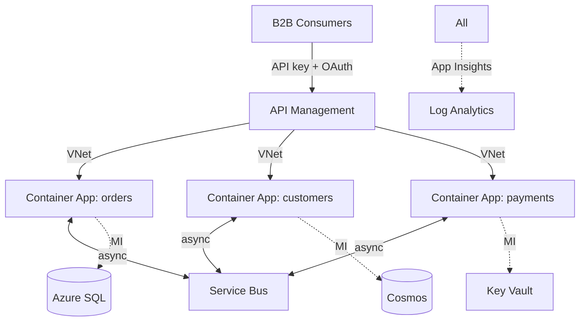

# Pattern: API + microservices

For multi-service backends, B2B APIs, internal service mesh, polyglot persistence.

## Architecture



## Components

| Component | Choice |
|---|---|
| API gateway | API Management (STv2 or Premium for VNet) |
| Compute | Container Apps internal env (one CA per service) |
| Async messaging | Service Bus Premium |
| Per-service data | Each service owns its DB; polyglot OK (SQL for orders, Cosmos for catalog) |
| Service discovery | Container Apps DAPR or just internal FQDNs |
| Tracing | OTel auto-instrumentation, App Insights as backend |

## Bicep additions

```bicep
module apim 'modules/apim.bicep' = {
  params: {
    name: 'apim-${namePrefix}-${environment}'
    skuName: environment == 'prod' ? 'Premium_2' : 'Developer_1'
    virtualNetworkType: 'Internal'
    subnetId: vnet.outputs.apimSubnetId
    publisherEmail: 'platform@acme.com'
    publisherName: 'Acme Platform'
  }
}

module sb 'modules/service-bus.bicep' = {
  params: {
    name: 'sb-${namePrefix}-${environment}'
    skuName: 'Premium'
    queues: [
      { name: 'order-events' }
      { name: 'payment-events' }
      { name: 'audit' }
    ]
    topics: [
      { name: 'customer-events', subscriptions: ['orders-svc', 'analytics-svc'] }
    ]
  }
}

// Per-service Container Apps in internal env
var services = ['orders', 'customers', 'payments']
@batchSize(1)
module svc 'modules/container-app.bicep' = [for s in services: {
  name: 'svc-${s}'
  params: {
    name: 'ca-${s}-${environment}'
    environmentId: caEnvInternal.outputs.id   // internal env
    ingressExternal: false
    ingressInternal: true
    targetPort: 8080
    ...
  }
}]
```

## APIM configuration

- **Subscription** per consumer org. Subscription key required.
- **Product** groups APIs (Public, Partner, Internal).
- **Policies** at API/operation level: rate-limit (e.g. 1000 calls/min/subscription), CORS, IP allowlist, JWT validate, transform request/response.
- **OAuth2 / OpenID** for delegated user-context calls.
- **Backend** = Container Apps internal FQDN; APIM in VNet reaches CA env.
- **Developer Portal** for public docs.

```xml
<!-- APIM policy snippet: rate limit + JWT -->
<inbound>
  <base />
  <rate-limit-by-key calls="1000" renewal-period="60" counter-key="@(context.Subscription.Id)" />
  <validate-jwt header-name="Authorization" failed-validation-httpcode="401">
    <openid-config url="https://login.microsoftonline.com/{tenant}/v2.0/.well-known/openid-configuration" />
    <required-claims>
      <claim name="aud"><value>{api-app-id}</value></claim>
    </required-claims>
  </validate-jwt>
</inbound>
```

## Service-to-service patterns

- **Sync HTTP**: service A calls service B at `https://ca-b.<env>.internal.azurecontainerapps.io`. AAD token + MI for auth (validate token in B).
- **Async**: A publishes to Service Bus topic; B subscribes. Use sessions for ordered processing per `customerId`.
- **DAPR** (in Container Apps): service invocation + state + pub/sub abstractions; Lite mesh.

## Data ownership

Each microservice owns its data store. Cross-service queries via API or Event-Driven sync (CDC + materialize in target service).

Don't share databases across services - defeats the point of microservices.

## Observability for microservices

- **OTel auto-instrumentation** in each service.
- W3C trace context propagated via headers - gives end-to-end traces across services.
- **Service Map** in App Insights shows dependencies + failure rates.
- **Failure correlation** by `operation_Id` - find the slow service in a chain.

## Versioning APIs

- **URL versioning** (`/v1/orders`) for breaking changes.
- **Header versioning** (`api-version: 2026-04-01`) for finer control.
- APIM supports both natively. Document deprecation timelines.

## When to skip microservices and stay monolith

If you have:
- < 5 services worth of bounded contexts.
- Single team owning everything.
- No org pressure for separate deploy cadence.

→ Stay with `webapp-saas` pattern. Modular monolith. Move to microservices only when team/org structure demands it.
