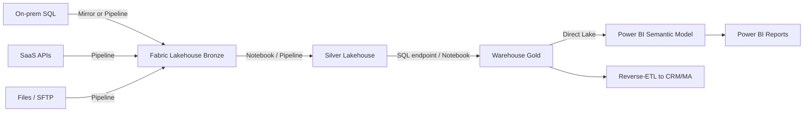

# Pattern: Data platform (lakehouse + BI)

For analytics workloads - bronze/silver/gold lakehouse, BI consumption, reverse-ETL, ML feature stores.

## Architecture (Fabric-default for 2026)



Default for new builds: **Microsoft Fabric** workspace with Lakehouse + Warehouse + pipelines + semantic model. Power BI reports consume via Direct Lake.

## Components

| Component | Choice | Why |
|---|---|---|
| Storage | OneLake (Fabric native) | Unified delta-parquet, shortcuts to ADLS/S3 |
| Bronze (raw) | Lakehouse | Land everything as-is, parquet |
| Silver (clean) | Lakehouse with Spark | Type cast, dedup, conform |
| Gold (curated marts) | Warehouse (T-SQL) | BI-friendly, governed |
| Orchestration | Fabric Data Pipelines (formerly ADF) | Native, integrated |
| Compute (heavy) | Fabric Spark notebooks | for transforms |
| Semantic model | Power BI semantic model in Direct Lake mode | no ETL into Import; query parquet directly |
| BI consumption | Power BI Reports + Apps | use sister skill `powerbi-implementation` |
| Governance | Microsoft Purview | data catalog + lineage + classification |
| Capacity | Fabric F-SKU (F2 minimum prod, F8+ for serious) | unified compute |

## Pre-Fabric stack (when not migrating)

If client has heavy investment in Synapse / Databricks / ADF, keep:
- ADLS Gen2 for storage.
- Synapse Serverless SQL pool for ad-hoc + Spark pool for transforms (or Databricks Spark).
- Azure Data Factory for orchestration.
- Power BI semantic model (Import or DirectQuery).
- Purview for governance.

## Bicep

Fabric resources are mostly NOT Bicep-deployable (preview-stage). Provision Fabric capacity via Bicep, then create items via Fabric REST API or UI.

```bicep
module fabric 'modules/fabric-capacity.bicep' = {
  name: 'fabric'
  params: {
    name: 'fab-${namePrefix}-${environment}'
    location: location
    tags: tags
    skuName: environment == 'prod' ? 'F8' : 'F2'
    administrators: ['admin@acme.com']
  }
}
```

For pre-Fabric:
```bicep
module synapse 'modules/synapse-workspace.bicep' = { ... }
module adls 'modules/storage.bicep' = { params: { kind: 'StorageV2', isHnsEnabled: true ... } }
module adf 'modules/data-factory.bicep' = { ... }
```

## Identity + RBAC

- **Pipelines / notebooks** authenticate via the Fabric workspace's identity (managed by Fabric).
- **External callers** (e.g. n8n triggering refresh, external app reading semantic model) use SP with workspace role.
- **Power BI semantic model** RLS via Entra ID groups → mapping table.

For Synapse/Databricks/ADF: workspace MI; assigned roles to ADLS (`Storage Blob Data Contributor`), KV (`Key Vault Secrets User`), source DB (AAD user mapped to MI).

## Data ingestion patterns

### Mirror (Fabric) - best for "live" copy

For Snowflake, Cosmos DB, Azure SQL, Postgres, Mongo, Salesforce: **Mirroring** replicates source into OneLake automatically as delta. No ETL code, sub-minute lag.

```bash
# UI-driven; no full Bicep yet. After capacity provisioned:
# Fabric portal → Workspace → New → Mirrored database → pick source type → connect
```

### Shortcuts - virtual reference

Point to ADLS/S3/GCS folder; OneLake reads as if local. No copy. Best for "we already have a lake; just expose it to Fabric".

### Pipelines (Copy / Dataflow Gen2)

Traditional batch. Schedule, parameters, branching. Use for SaaS connectors that don't have mirroring.

### Eventstream / Eventhouse

Real-time streaming → KQL store → BI/alerts. Pair with Event Hubs.

## Governance (Purview)

Provision at tenant scope:
```bicep
module purview 'modules/purview.bicep' = { ... }
```

Then:
- Connect data sources (Fabric, ADLS, on-prem SQL, etc.).
- Run scans → catalog populated automatically.
- Classification rules for PII detection.
- Lineage end-to-end (source → bronze → silver → gold → semantic model → report).
- Glossary terms applied to assets.
- Access policies (data owner approves access requests via Purview).

## CI/CD for data platform

- **Lakehouse / Warehouse / Notebook**: Fabric Git integration → Azure DevOps / GitHub repo.
- **Power BI semantic model**: TMDL committed; deploy via Tabular Editor CLI (covered in `powerbi-implementation` skill).
- **Pipelines**: definition JSON in repo, deployed via Fabric REST API.

## Cost shape

- F2: ~$262/mo. Pause/resume off-hours.
- F8: ~$1050/mo. Standard prod for moderate workloads.
- F32: ~$4200/mo. Serious BI + data engineering.
- Storage cost: minimal in OneLake (~$23/TB/mo); Mirror has additional CU consumption.

## Adjacent integrations

- **Power BI consumption**: see `powerbi-implementation` skill for model + RLS + reports.
- **CRM source mirroring**: HubSpot / Salesforce via Fabric mirror or pipeline; reverse-ETL with Hightouch / Census if pushing back to CRM.
- **n8n**: trigger pipelines from external events via Fabric REST API.
- **ML on top**: Fabric Data Science (notebooks + experiments + endpoints) on the same lakehouse.
- **Sentinel**: ingest pipeline failure + audit events from Fabric to LA → Sentinel rules for anomaly.
