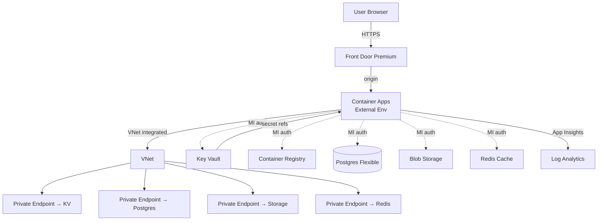

# Pattern: Web app / SaaS

Default architecture for "user-facing web app with a database" - internal tool, customer portal, B2B SaaS.

## Architecture



## Components

| Component | Choice | Why |
|---|---|---|
| Compute | Container Apps (External env, workload profiles for prod) | scale-to-zero on dev, predictable on prod |
| Database | Azure Database for PostgreSQL Flexible Server | OSS, AAD auth, Flexible's HA |
| Cache | Redis Cache Standard (Premium for prod) | session + cache |
| Storage | Storage Account v2 (Blob) | uploads, logs |
| Secrets | Key Vault (RBAC mode) | KV references in CA app config |
| Container registry | ACR Standard with PE | image source for CA |
| CDN + WAF | Front Door Premium | global L7, WAF, custom domain, certs auto-issued |
| Identity (workload) | UMI shared by all CA apps | single identity, multiple grants |
| Identity (users) | Entra ID (workforce) or Entra External ID (customers) | based on audience |
| Observability | LA + App Insights workspace-based | one per env |
| Networking | VNet `/16` per env, 4 subnets, NSGs default-deny | private data plane |

## Bicep composition (`main.bicep` for this pattern)

```bicep
targetScope = 'resourceGroup'

@allowed(['dev','test','prod'])
param environment string
param namePrefix string
param location string = resourceGroup().location
param sqlAdminGroupObjectId string  // AAD group that admins the DB

var tags = {
  Environment: environment
  Project: namePrefix
  ManagedBy: 'bicep'
  Owner: 'platform-team@acme.com'
  CostCenter: 'ENG-Platform'
}

// Foundation
module la 'modules/log-analytics.bicep' = {
  name: 'la'
  params: { name: 'la-${namePrefix}-${environment}', location: location, tags: tags }
}

module ai 'modules/app-insights.bicep' = {
  name: 'ai'
  params: {
    name: 'ai-${namePrefix}-${environment}'
    location: location
    workspaceId: la.outputs.workspaceId
    tags: tags
  }
}

module umi 'modules/managed-identity.bicep' = {
  name: 'umi'
  params: { name: 'umi-${namePrefix}-${environment}', location: location, tags: tags }
}

// Network
module vnet 'modules/vnet.bicep' = {
  name: 'vnet'
  params: {
    name: 'vnet-${namePrefix}-${environment}'
    addressPrefix: environment == 'prod' ? '10.30.0.0/16' : '10.10.0.0/16'
    location: location
    tags: tags
  }
}

// Data
module kv 'modules/key-vault.bicep' = {
  name: 'kv'
  params: {
    name: 'kv-${namePrefix}-${environment}-${take(uniqueString(resourceGroup().id),5)}'
    location: location
    tags: tags
    privateEndpointSubnetId: vnet.outputs.dataSubnetId
    workspaceId: la.outputs.workspaceId
  }
}

module pg 'modules/postgres-flexible.bicep' = {
  name: 'pg'
  params: {
    name: 'pg-${namePrefix}-${environment}'
    location: location
    tags: tags
    delegatedSubnetId: vnet.outputs.dataSubnetId
    skuName: environment == 'prod' ? 'Standard_D2ds_v5' : 'Standard_B1ms'
    aadAdminGroupObjectId: sqlAdminGroupObjectId
    workspaceId: la.outputs.workspaceId
  }
}

module redis 'modules/redis.bicep' = if (environment != 'dev') {
  name: 'redis'
  params: {
    name: 'redis-${namePrefix}-${environment}'
    location: location
    tags: tags
    skuName: environment == 'prod' ? 'Premium' : 'Standard'
    privateEndpointSubnetId: vnet.outputs.dataSubnetId
    workspaceId: la.outputs.workspaceId
  }
}

module storage 'modules/storage.bicep' = {
  name: 'storage'
  params: {
    name: 'st${namePrefix}${environment}${take(uniqueString(resourceGroup().id),5)}'
    location: location
    tags: tags
    privateEndpointSubnetId: vnet.outputs.dataSubnetId
    workspaceId: la.outputs.workspaceId
  }
}

// Container registry
module acr 'modules/acr.bicep' = {
  name: 'acr'
  params: {
    name: 'acr${namePrefix}${environment}'
    location: location
    tags: tags
    sku: environment == 'prod' ? 'Premium' : 'Standard'
    privateEndpointSubnetId: environment == 'prod' ? vnet.outputs.dataSubnetId : ''
    workspaceId: la.outputs.workspaceId
  }
}

// Container Apps env + app
module caEnv 'modules/container-apps-env.bicep' = {
  name: 'caEnv'
  params: {
    name: 'cae-${namePrefix}-${environment}'
    location: location
    tags: tags
    workspaceId: la.outputs.workspaceId
    appInsightsConnectionString: ai.outputs.connectionString
    infrastructureSubnetId: vnet.outputs.computeSubnetId
    workloadProfiles: environment == 'prod' ? [
      { name: 'Consumption', workloadProfileType: 'Consumption' }
      { name: 'D4', workloadProfileType: 'D4', minimumCount: 1, maximumCount: 3 }
    ] : [
      { name: 'Consumption', workloadProfileType: 'Consumption' }
    ]
  }
}

module app 'modules/container-app.bicep' = {
  name: 'app'
  params: {
    name: 'ca-${namePrefix}-app-${environment}'
    location: location
    tags: tags
    environmentId: caEnv.outputs.id
    userAssignedIdentityId: umi.outputs.id
    containerImage: '${acr.outputs.loginServer}/app:latest'
    registryServer: acr.outputs.loginServer
    targetPort: 8080
    minReplicas: environment == 'prod' ? 2 : 0
    maxReplicas: environment == 'prod' ? 10 : 3
    workloadProfileName: environment == 'prod' ? 'D4' : 'Consumption'
    envVars: [
      { name: 'AZURE_CLIENT_ID', value: umi.outputs.clientId }
      { name: 'POSTGRES_HOST', value: pg.outputs.fqdn }
      { name: 'POSTGRES_DB', value: 'app' }
      { name: 'POSTGRES_USER', value: umi.outputs.principalId }     // app authenticates as MI
      { name: 'STORAGE_ACCOUNT', value: storage.outputs.name }
      { name: 'KEY_VAULT_URI', value: kv.outputs.uri }
      { name: 'APPLICATIONINSIGHTS_CONNECTION_STRING', value: ai.outputs.connectionString }
    ]
  }
}

// RBAC: UMI on data plane
module rbacKv 'modules/role-assignment.bicep' = {
  name: 'rbac-kv'
  params: {
    principalId: umi.outputs.principalId
    roleDefinitionId: '4633458b-17de-408a-b874-0445c86b69e6'  // KV Secrets User
    scope: kv.outputs.id
  }
}
module rbacAcr 'modules/role-assignment.bicep' = {
  name: 'rbac-acr'
  params: {
    principalId: umi.outputs.principalId
    roleDefinitionId: '7f951dda-4ed3-4680-a7ca-43fe172d538d'  // AcrPull
    scope: acr.outputs.id
  }
}
module rbacStorage 'modules/role-assignment.bicep' = {
  name: 'rbac-storage'
  params: {
    principalId: umi.outputs.principalId
    roleDefinitionId: 'ba92f5b4-2d11-453d-a403-e96b0029c9fe'  // Storage Blob Data Contributor
    scope: storage.outputs.id
  }
}

// Front Door
module fd 'modules/front-door.bicep' = {
  name: 'fd'
  params: {
    name: 'fd-${namePrefix}-${environment}'
    tags: tags
    sku: 'Premium_AzureFrontDoor'
    customDomain: environment == 'prod' ? 'app.acme.com' : ''
    originHost: app.outputs.fqdn
    workspaceId: la.outputs.workspaceId
  }
}

// Budget + alerts
module budget 'modules/budget.bicep' = {
  name: 'budget'
  params: {
    name: 'budget-${namePrefix}-${environment}'
    amount: environment == 'prod' ? 5000 : 500
    contactEmails: ['platform-team@acme.com']
  }
}

output frontDoorUrl string = fd.outputs.endpointUrl
output containerAppUrl string = 'https://${app.outputs.fqdn}'
output keyVaultUri string = kv.outputs.uri
```

## Deployment

```bash
# Login + provision RG
az login
az group create -n rg-acme-prod -l westeurope --tags Environment=prod

# What-if first
az deployment group what-if -g rg-acme-prod -f main.bicep -p prod.bicepparam

# Deploy
bash scripts/provision.sh prod

# Validate
bash scripts/validate.sh prod
```

## Post-deploy hooks

1. **Configure Postgres roles** for the app's MI:
   ```sql
   CREATE ROLE "umi-acme-prod" LOGIN;
   GRANT CONNECT ON DATABASE app TO "umi-acme-prod";
   GRANT USAGE ON SCHEMA public TO "umi-acme-prod";
   GRANT SELECT, INSERT, UPDATE, DELETE ON ALL TABLES IN SCHEMA public TO "umi-acme-prod";
   ```
   Run as the AAD admin (the group from `sqlAdminGroupObjectId`).

2. **Push first image** to ACR:
   ```bash
   az acr build --registry acracmeprod --image app:v1 --file Dockerfile .
   az containerapp update -n ca-acme-app-prod -g rg-acme-prod --image acracmeprod.azurecr.io/app:v1
   ```

3. **Wire CI/CD** with `templates/github-actions/container-build-deploy.yml`.

4. **Custom domain on Front Door**: `az afd custom-domain create ...`; verify TXT record at DNS.

## Variations

- **Internal-only (no public web)**: skip Front Door, switch CA env to `internal`, expose via VPN/Private Link.
- **Multi-region active-active**: deploy this stack in 2 regions, FD multi-origin, Postgres geo-replication, Redis geo-replication, KV geo-redundant. See `workflows/multi-region-active-active.md`.
- **Embed customer auth**: replace Entra ID with Entra External ID for customers.
- **Stripe webhooks**: add Service Bus + Function for webhook processing; Stripe → CA endpoint or Function.
- **B2B partner API**: add APIM in front of CA backend; subscription keys + OAuth.

## Adjacent integrations (skill stitches automatically)

- **Sentinel SIEM**: enable Defender plans + Sentinel data connectors on the LA workspace.
- **Datadog/New Relic**: keep App Insights as backbone, mirror via OTel exporter to 3rd party.
- **Stripe / payment**: webhook endpoint as a separate CA app + Service Bus.
- **CRM (Monday/HubSpot)**: outbound integration via Service Bus event consumer or Function HTTP trigger.
- **Email/SMS (Mailgun/Twilio)**: store API keys in KV, MI fetch.

## Cost shape (West Europe pricing approx)

| Tier | Monthly |
|---|---|
| Dev (CA Consumption, B1ms PG, no Redis, F1 ACR) | ~$60–$120 |
| Standard prod (CA D4 + 2 replicas, D2ds PG, Standard Redis, Premium ACR, FD Premium) | ~$700–$1500 |
| Enterprise (CA dedicated workload + 4 replicas, Hyperscale PG, Premium Redis, Premium ACR with PE, FD Premium WAF) | ~$2500–$8000+ |

Add ~$50–$200/mo for LA + AI ingestion depending on traffic.
